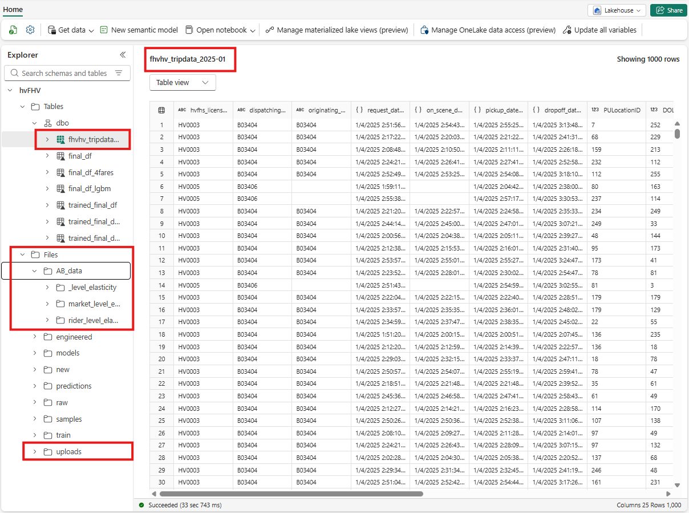
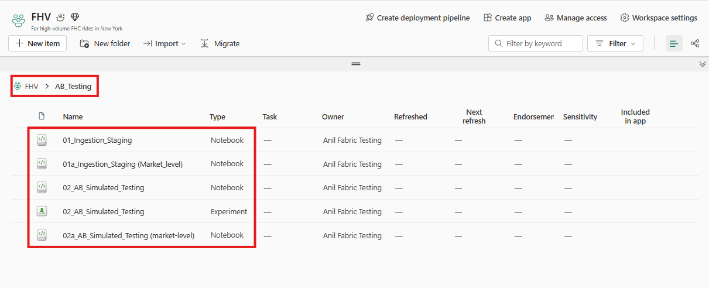

# Market-level A/B Simulation of Surge Pricing

# Market Elasticity Project

## Table of Contents

- [Project Overview (Non-Technical Summary)](##project-overview-non-technical-summary)
- [Getting Started / How to use this Repo](##getting-started--how-to-use-this-repo)
- [https://github.com/AwesomeAnil/market-elasticity-ab-tests/blob/main/README.md#2-getting-started--how-to-use-this-repo](url)
- [Step-by-Step Workflow](##step-by-step-workflow)
- [Results & Interpretaion](##dresults--interpretation)
- [Technical Appendix](##technical-appendix)
- https://github.com/AwesomeAnil/market-elasticity-ab-tests#b-setup-a-new-fabric-trial-capacity-or-use-an-existing-fabric-capacity

- [Project Overview (Non-Technical Summary)](#project-overview-non-technical-summary)
- [Results & Interpretation](#results-interpretation)
- [Getting Started / How to use this Repo](#getting-started--how-to-use-this-repo)

---

## 1. Project Overview (Non-Technical Summary)

This project simulates the impact of a **20% surge in fares** on rider acceptance and revenue.
Ride requests are split into **control** (baseline fares) and **treatment** (surged fares) groups.

We measure:

* **Elasticity of demand** (how acceptance responds to fare increases)
* **Revenue lift** (whether higher fares offset any reduced acceptance)
* **Segment-level differences** (Airport vs. non-Airport, Peak vs. Off-Peak, Weekend vs. Weekday, Distance bands, Time bands)

**Key finding (summary):** Surge pricing reduces acceptance overall but increases per-request revenue in many segments; the magnitude and sign vary substantially by segment — some ride types show net revenue gains, others net revenue loss.

---

## 2. Getting Started / How to use this Repo

### A). Clone the repository

#### Using HTTPS 
git clone https://github.com/AwesomeAnil/market-elasticity-ab-tests.git

#### Using SSH
git clone git@github.com:AwesomeAnil/market-elasticity-ab-tests.git

### B). Setup a new Fabric trial capacity or use an existing fabric capacity. 

Visit the following links: 

- https://learn.microsoft.com/en-us/fabric/fundamentals/fabric-trial 
- https://learn.microsoft.com/en-us/fabric/fundamentals/fabric-trial?utm_source=chatgpt.com#start-the-fabric-capacity-trial
- https://microsoft.github.io/Data-AI-Kenya-Hack/CREATE_FABRIC_CAPACITY.html

### B) Data Sources 

## Data Sources

The project uses the following datasets:

| Dataset Name                     | Description                                     | Format  | Source / Access Link |
|----------------------------------|-------------------------------------------------|--------|--------------------|
| HVFHV Trip Data 2025-01           | Real taxi trip data for January 2025         | CSV/Parquet | [Fabric Lakehouse Table](#) |

**Link to data**: https://www.nyc.gov/site/tlc/about/tlc-trip-record-data.page 

**Downloaded file name**: 2025 \ January \ For-Hire Vehicle Trip Records (PARQUET)

**Data Dictionary**: 

### C) Fabric Lakehouse Folders  

Lakehouse: "hvFHV"  (high volume For Hire Services) 

## Lakehouse Folder Structure

📂 Tables  
│   ├── 📄 hvfhv_tripdata_2025-01

📂 Files  
│   ├── 📂 uploads/  
│   │   └── 📄 hvFHV_trip_data_2025-01.parquet  
│   ├── 📂 AB_data/  
│   │   └── 📂 market_level_elasticity 
│       	└── 📄 staged_df.parquet  
│   │   └── 📂 rider_level_elasticity 
│       	└── 📄 file001.parquet  
│       	└── 📄 file002.parquet  
│       	└── 📄 file003.parquet  
│       	└── 📄 file004.parquet  
│       	└── 📄 file005.parquet  

## Workspace folder structure for Notebooks

---

## 3. Step-by-Step Workflow

1. **Data Load** — Read staged trip-level parquet with `pickup_datetime`, `trip_miles`, `trip_time`, `base_passenger_fare`, `is_airport`, `is_peak`, `is_weekend`, `distance_segment`, `time_segment`, etc. (from the notebook).&#x20;
2. **Experiment Setup** — `surge_multiplier = 1.2` applied to treatment group to create `fare_exp`.
3. **Acceptance Model** — logistic model: `p_accept = 1 / (1 + exp(alpha*(fare_exp - beta)))` (alpha and beta set in the notebook).
4. **Simulation** — Bernoulli draws from `p_accept` to create `accepted`.
5. **Revenue** — `revenue = accepted * fare_exp`.
6. **Aggregation & Metrics** — For each segment & group compute mean acceptance, mean fare, mean revenue, elasticity (as implemented), revenue difference (`rev_diff`), and sample sizes.
7. **Statistical tests** — proportions z-test for acceptance counts and t-test for revenue per request. (Exact outputs included below.)&#x20;

---

## 4. Results & Interpretation

### A. All-up (Market-level) Summary

* Group-level acceptance rates:

  * **Control** acceptance = **0.5010**
  * **Treatment** acceptance = **0.4261**.&#x20;
* Mean revenue (base fares) by group:

  * `rev_base_fare` — control = **5.9731**, treatment = **9.5152**.&#x20;
* Mean revenue (with surged fares):

  * `revenue` — control = **5.9731**, treatment = **11.4182**.&#x20;
* Acceptance differences:

  * **Absolute**: **-0.0749** (control → treatment).
  * **Relative**: **-14.94%**.&#x20;
* Fare differences (base / surge):

  * **Base fare difference (abs)** = **3.5421** (≈ +59.30%).
  * **Surge fare difference (abs)** = **5.4452** (≈ +91.16%).&#x20;
* **Elasticity (arc method, market level)**: **-0.8878**.&#x20;

**Interpretation (all-up):** The treatment reduces acceptance by \~7.5 percentage points (≈15% relatively), while treatment revenue per request increases markedly (≈91% higher than control revenue with surge fares). Arc elasticity ≈ −0.89 indicates moderately elastic response overall — price increases reduce acceptance substantially but in this simulation the revenue per-request increase outweighs the average acceptance drop (see t-test below).&#x20;

---

### B. Statistical Tests (market-level)

**Z-Test (acceptance rates)**

* Success counts (accepted) and observations (n): treatment successes = **108,461**, control successes = **127,125**; observations treatment = **254,541**, control = **253,760**.&#x20;
* **Acceptance rate test result**: **z = −53.515389**, **p = 0.000000**.&#x20;

**Interpretation (z-test):** The very large negative z indicates the treatment acceptance rate is statistically significantly *lower* than control (p ≪ 0.001). With large sample sizes, even small relative differences become highly significant.

**T-Test (revenue per request)**

* Mean revenue by group (revenue column): control = **5.97**, treatment = **11.42**.&#x20;
* **Revenue test result**: **t = −165.719**, **p = 0.0000**.&#x20;

**Interpretation (t-test):** The t statistic (very large in magnitude) shows the two groups have statistically different mean revenues per request (tied to the surge). Given p ≈ 0, the difference is highly significant. Note: the t-test compares per-request revenue distributions (not total revenue); with the surge the per-request revenue increases substantially despite lower acceptance.

> Combined reading: acceptance drops are significant (z-test), per-request revenue increases are highly significant (t-test). The business decision depends on whether revenue-per-request gains and accept rate changes translate to net financial goals (total revenue, profitability, retention, downstream effects).

*(Source for the above z/t test prints and group summaries: the notebook HTML export.)*&#x20;

---

### C. Segment-level Full Tables (copied from notebook outputs)

> All tables below are reproduced from the notebook outputs in the attached HTML notebook export.&#x20;

#### Airport vs Non-Airport

| Metric            | Non-Airport | Airport |
| ----------------- | ----------: | ------: |
| Elasticity        |       -0.69 |   -1.51 |
| Rev\_diff         |        8.13 |   10.23 |
| Accept\_control   |        0.39 |    0.18 |
| Accept\_treatment |        0.35 |    0.14 |
| Fare\_control     |       21.72 |   59.04 |
| Fare\_treatment   |       26.07 |   70.29 |
| Rev\_control      |        8.41 |    0.61 |
| Rev\_treatment    |       16.54 |   10.84 |
| N\_control        |     222,157 | 23,4475 |
| N\_treatment      |     222,824 | 235,257 |

*(Source: notebook output table).*&#x20;

**Interpretation:** Airport rides show much higher price sensitivity (larger negative elasticity) and large fare levels; some airport bands show net revenue gains in the notebook's distance/time breakdowns, but airport vs non-airport at this aggregation has the shown patterns.

---

#### Peak vs Off-Peak

| Metric            | Off-Peak (0) | Peak (1) |
| ----------------- | -----------: | -------: |
| Elasticity        |        -0.55 |    -0.54 |
| Rev\_diff         |         5.84 |     5.22 |
| Accept\_control   |         0.45 |     0.46 |
| Accept\_treatment |         0.40 |     0.41 |
| Fare\_control     |        24.75 |    24.00 |
| Fare\_treatment   |        29.75 |    28.78 |
| Rev\_control      |         5.75 |     6.10 |
| Rev\_treatment    |        11.59 |    11.32 |
| N\_control        |       92,746 |  161,014 |
| N\_treatment      |       92,639 |  161,902 |

*(Source: notebook output table).*&#x20;

**Interpretation:** Both peak and off-peak show positive rev\_diff in the notebook; elasticity magnitudes are similar at this level.

---

#### Weekend vs Weekday

| Metric            | Weekday (0) | Weekend (1) |
| ----------------- | ----------: | ----------: |
| Elasticity        |       -0.55 |       -0.53 |
| Rev\_diff         |        5.45 |        5.43 |
| Accept\_control   |        0.45 |        0.46 |
| Accept\_treatment |        0.41 |        0.42 |
| Fare\_control     |       24.77 |       22.95 |
| Fare\_treatment   |       29.77 |       27.41 |
| Rev\_control      |        5.92 |        6.11 |
| Rev\_treatment    |       11.37 |       11.54 |
| N\_control        |     185,005 |      68,755 |
| N\_treatment      |     185,555 |      68,986 |

*(Source: notebook output table).*

**Interpretation:** Similar rev\_diff and elasticity across weekend/weekdays at this aggregate level.

---

#### Distance Segments (full matrix form reproduced)

| distance\_segment     | elasticity | rev\_diff | accept\_control | accept\_treatment | fare\_control | fare\_treatment | rev\_control | rev\_treatment | n\_control | n\_treatment |
| --------------------- | ---------: | --------: | --------------: | ----------------: | ------------: | --------------: | -----------: | -------------: | ---------: | -----------: |
| airport/suburban11-26 |      -1.89 |     11.26 |            0.16 |              0.12 |         57.86 |           69.70 |         0.05 |          11.31 |      23486 |        23591 |
| ext urban6-11         |      -1.14 |     17.39 |            0.32 |              0.26 |         34.72 |           41.44 |         0.66 |          18.05 |      37664 |        37888 |
| short≤3               |      -0.33 |     -2.69 |            0.56 |              0.52 |         13.59 |           16.38 |         9.57 |           6.88 |     132351 |       132723 |
| urban3-6              |      -0.70 |     14.10 |            0.44 |              0.38 |         23.60 |           28.37 |         3.88 |          17.99 |      57578 |        57700 |
| very\_long>26         |      -4.43 |      1.83 |            0.02 |              0.01 |        125.32 |          148.22 |         0.00 |           1.83 |       4237 |         4213 |

*(Source: notebook output table).*&#x20;

**Interpretation:** Short trips show revenue loss under surge; medium/long bands often show revenue gains; very long trips have high elasticity but small sample sizes.

---

#### Time Segments

| time\_segment | elasticity | rev\_diff | accept\_control | accept\_treatment | fare\_control | fare\_treatment | rev\_control | rev\_treatment | n\_control | n\_treatment |
| ------------- | ---------: | --------: | --------------: | ----------------: | ------------: | --------------: | -----------: | -------------: | ---------: | -----------: |
| long 85-99%   |      -1.49 |     12.99 |            0.21 |              0.16 |         51.66 |           61.97 |         0.30 |          13.29 |     35,598 |       35,472 |
| medium 50-85% |      -0.79 |     14.87 |            0.40 |              0.35 |         26.82 |           32.27 |         2.98 |          17.85 |     88,388 |       89,326 |
| short ≤50%    |      -0.32 |     -3.23 |            0.56 |              0.53 |         13.16 |           15.83 |         9.76 |           6.53 |    127,241 |      127,196 |
| verylong >99% |      -3.22 |      3.82 |            0.06 |              0.03 |        108.70 |          126.46 |         0.04 |           3.86 |      2,533 |        2,547 |

*(Source: notebook output table).*

**Interpretation:** Medium & long time segments show strong revenue lift; short time segment shows a revenue decline.

---

## 5. Technical Appendix

* **Acceptance model (notebook)**:

  $$
  p_i = \frac{1}{1 + \exp(\alpha(f_i - \beta))}
  $$

  (Notebook uses `alpha` and `beta` as documented above).&#x20;
* **Elasticity (as computed)**:

  $$
  E = \frac{(\bar{p}_t - \bar{p}_c)/\bar{p}_c}{(\bar{f}_t - \bar{f}_c)/\bar{f}_c}
  $$
* **Statistical tests**:

  * `proportions_ztest(successes, nobs, alternative='smaller')` → z and p printed.&#x20;
  * `scipy.stats.ttest_ind(control_rev, treatment_rev)` → t and p printed.&#x20;

---
