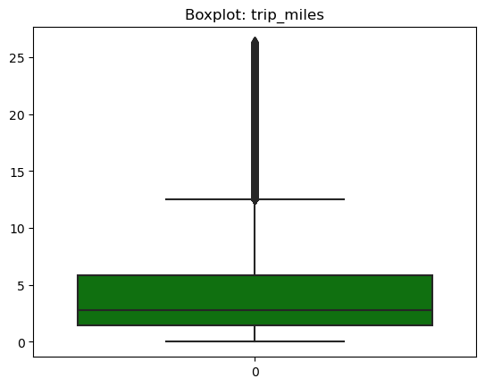

# Market-Level A/B Testing Simulation of Surge Pricing

**Project:** Market Elasticity Simulation  
**Notebook:** 02a_AB_Simulated_Testing (market-level).ipynb  
**Date:** 2025-09-22  
**Author:** [AwesomeAnil](https://github.com/AwesomeAnil)

---

## Table of Contents

1. [Introduction & Objective](#introduction--objective)
2. [Experiment Design](#experiment-design)
3. [Data Description](#data-description)
4. [A/B Simulation: Steps & Methods](#ab-simulation-steps--methods)
5. [Key Results](#key-results)
6. [Statistical Tests](#statistical-tests)
7. [Segment Analyses](#segment-analyses)
8. [Exploratory Visualizations](#exploratory-visualizations)
9. [Interpretation & Business Implications](#interpretation--business-implications)
10. [Appendix: Technical Notes](#appendix-technical-notes)

---

## Introduction & Objective

This project simulates an A/B experiment at the market level to measure the impact of **20% surge pricing** on ride acceptance and revenue.

**Key Question:**  
> Does surge pricing reduce rider acceptance, and if so, is the revenue lift sufficient to offset the drop?

---

## Experiment Design

- **Control Group (C):** Baseline fares  
- **Treatment Group (T):** Fares increased by 20% (surge)
- **Random assignment:** 50:50 split
- **Acceptance modeled:** Using a logistic demand model (price elasticity)

**Group Legend:**  
- **(C): Control group**  
- **(T): Treatment group** (20% surge applied)

**Hypotheses:**  
- **H₀ (Null):** Surge pricing does not change acceptance rate  
- **H₁ (Alt):** Surge pricing reduces acceptance rate

---

## Data Description

- **Source:** NYC For-Hire Vehicle Trip Data, January 2025 ([download link](https://www.nyc.gov/site/tlc/about/tlc-trip-record-data.page))
- **Staged in:** Fabric Lakehouse
- **Columns:**  
    - `pickup_datetime`, `trip_miles`, `trip_time`, `base_passenger_fare`, `is_airport`, `is_peak`, `is_weekend`, `distance_segment`, `time_segment`

**Sample Preview:**
| pickup_datetime      | trip_miles | base_passenger_fare | is_airport | is_peak | is_weekend | distance_segment      | time_segment    |
|---------------------|------------|---------------------|------------|---------|------------|----------------------|-----------------|
| 2025-01-04 14:57:17 | 4.50       | 31.33               | 0          | 1       | 1          | urban3-6             | long 85-99%     |
| 2025-01-04 14:21:39 | 2.39       | 13.38               | 0          | 1       | 1          | short≤3              | short ≤50%      |
| ...                 | ...        | ...                 | ...        | ...     | ...        | ...                  | ...             |

---

## A/B Simulation: Steps & Methods

1. **Random Assignment:** Each ride assigned to `control` or `treatment` (50:50).
2. **Surge Application:**  
   - `fare_exp = base_passenger_fare * 1.2` for treatment,  
   - `fare_exp = base_passenger_fare` for control.
3. **Acceptance Probability:**  
   - Modeled as:  
     $$
     p_{accept} = \frac{1}{1 + \exp(\alpha \times (fare_{exp} - \beta))}
     $$
   - Parameters:  
     - $\alpha = 0.05$ (price sensitivity)  
     - $\beta =$ median fare (≈ 18)
4. **Acceptance Simulation:**  
   - For each ride: accepted = Bernoulli($p_{accept}$)
5. **Revenue Calculation:**  
   - `revenue = fare_exp * accepted`

---

## Key Results

### **Market-Level Summary**

| Group      | Acceptance Rate | Avg Fare | Avg Revenue per Request | Sample Size |
|------------|----------------|----------|------------------------|-------------|
| Control (C)    | 0.50           | \$24.28  | \$5.97                 | 253,760     |
| Treatment (T)  | 0.43           | \$29.13  | \$11.42                | 254,541     |

- **Acceptance Rate drop:** -7.5 percentage points (≈ -15%)
- **Revenue per request:** +91% (treatment vs. control)
- **Elasticity (arc method):** -0.89

---

## Statistical Tests

- **Acceptance (Z-Test):**  
  - Test statistic: z = -53.52, p < 0.001  
  - **Result:** The drop in acceptance rate is statistically significant.

- **Revenue (T-Test):**  
  - Test statistic: t = -165.72, p < 0.001  
  - **Result:** The increase in revenue per request is statistically significant.

---

## Segment Analyses

> **Legend:** (C) = Control group, (T) = Treatment group (20% surge)

### **Airport vs. Non-Airport**

|           | Non-Airport | Airport    |
|-----------|-------------|------------|
| Elasticity| -0.51       | -1.51      |
| Rev Diff  | +5.05       | +10.23     |
| Accept (C)| 0.47        | 0.18       |
| Accept (T)| 0.43        | 0.14       |
| Fare (C)  | \$21.42     | \$59.04    |
| Fare (T)  | \$25.76     | \$70.29    |
| Rev (C)   | \$6.41      | \$0.61     |
| Rev (T)   | \$11.47     | \$10.84    |

**Interpretation:** Airport rides are more price sensitive but show large revenue gains under surge.

---

### **Peak vs. Off-Peak**

|           | Off-Peak    | Peak       |
|-----------|-------------|------------|
| Elasticity| -0.55       | -0.54      |
| Rev Diff  | +5.84       | +5.22      |
| Accept (C)| 0.45        | 0.46       |
| Accept (T)| 0.40        | 0.41       |
| Fare (C)  | \$24.75     | \$24.00    |
| Fare (T)  | \$29.75     | \$28.78    |
| Rev (C)   | \$5.75      | \$6.10     |
| Rev (T)   | \$11.59     | \$11.32    |

---

### **Weekend vs. Weekday**

|           | Weekday     | Weekend    |
|-----------|-------------|------------|
| Elasticity| -0.55       | -0.53      |
| Rev Diff  | +5.45       | +5.43      |
| Accept (C)| 0.45        | 0.46       |
| Accept (T)| 0.41        | 0.42       |
| Fare (C)  | \$24.77     | \$22.95    |
| Fare (T)  | \$29.77     | \$27.41    |
| Rev (C)   | \$5.92      | \$6.11     |
| Rev (T)   | \$11.37     | \$11.54    |

---

### **Distance Segments**

| Segment                | Elasticity | Rev Diff | Accept (C) | Accept (T) | Fare (C) | Fare (T) | Rev (C) | Rev (T) |
|------------------------|-----------|----------|------------|------------|----------|----------|---------|---------|
| airport/suburban11-26  | -1.89     | 11.26    | 0.16       | 0.12       | 57.86    | 69.70    | 0.05    | 11.31   |
| ext urban6-11          | -1.14     | 17.39    | 0.32       | 0.26       | 34.72    | 41.44    | 0.66    | 18.05   |
| short≤3                | -0.33     | -2.69    | 0.56       | 0.52       | 13.59    | 16.38    | 9.57    | 6.88    |
| urban3-6               | -0.70     | 14.10    | 0.44       | 0.38       | 23.60    | 28.37    | 3.88    | 17.99   |
| very_long>26           | -4.43     | 1.83     | 0.02       | 0.01       | 125.32   | 148.22   | 0.00    | 1.83    |

---

### **Time Segments**

| Segment         | Elasticity | Rev Diff | Accept (C) | Accept (T) | Fare (C) | Fare (T) | Rev (C) | Rev (T) |
|-----------------|-----------|----------|------------|------------|----------|----------|---------|---------|
| long 85-99%     | -1.49     | 12.99    | 0.21       | 0.16       | 51.66    | 61.97    | 0.30    | 13.29   |
| medium 50-85%   | -0.79     | 14.87    | 0.40       | 0.35       | 26.82    | 32.27    | 2.98    | 17.85   |
| short ≤50%      | -0.32     | -3.23    | 0.56       | 0.53       | 13.16    | 15.83    | 9.76    | 6.53    |
| verylong >99%   | -3.22     | 3.82     | 0.06       | 0.03       | 108.70   | 126.46   | 0.04    | 3.86    |

---

## Exploratory Visualizations

> **Note:** Please export the following plots from the notebook and save them (e.g., in an `images/` folder) to display here.

### **Acceptance Probability Histogram**
- 

### **Revenue per Request Boxplot by Group**
- 
*Revenue per request for Control (C) and Treatment (T) groups.*

### **Acceptance Rate Bar Plot by Segment**
- 
*Acceptance rates for (C) and (T) by market segment (e.g., airport, peak, weekend).*

### **(EDA - Univariate plots)**

- *Distribution of base passenger fares*
- 

- *Distribution of trim times*
- 

- *Distribution of trip miles*
- 

- *Boxplot - base passenger fares*
- 

- *Boxplot - Trip Miles* 
-  

- *Boxplot - Trip Time* 
-  

> _Each plot should have a descriptive caption. If you need help exporting images from your Python notebook, see [matplotlib's savefig](https://matplotlib.org/stable/api/_as_gen/matplotlib.pyplot.savefig.html) or Jupyter's image export tools._

---

## Interpretation & Business Implications

- **Surge pricing reduces acceptance rates,** but **increases revenue per request**.
- **Elasticity varies by segment:** Airport and long-distance rides are most price sensitive.
- **Revenue lift is strongest** for airport/long/medium segments; **short rides may see a net revenue loss**.
- **Statistical significance:** Both the drop in acceptance and the revenue lift are highly significant (very small p-values).
- **Business tradeoff:** Decision depends on whether increased per-request revenue justifies the lower acceptance rate and potential rider churn.

---

## Appendix: Technical Notes

- **Acceptance model:**  
  $$
  p_{accept} = \frac{1}{1 + \exp(\alpha \times (fare_{exp} - \beta))}
  $$
  - $\alpha = 0.05$ (price sensitivity)
  - $\beta$ = median base fare (~\$18)
- **Elasticity calculation:**  
  $$
  elasticity = \frac{(\bar{p}_T - \bar{p}_C)/\bar{p}_M}{(\bar{f}_T - \bar{f}_C)/\bar{f}_M}
  $$
  Where $T$ = treatment, $C$ = control, $M$ = mean of both.
- **Statistical tests:**
  - Proportions Z-Test: `proportions_ztest(successes, nobs, alternative='smaller')`
  - Revenue T-Test: `ttest_ind(control_rev, treatment_rev)`
- **Simulation logic and code:** See the original notebook for details.

---

## (Instructions for Contributors)

- **Add images:** Export your plots as `.png` and update the links above.
- **Contribute:** Feel free to add new segment analyses or deeper dives into specific markets.
- **Questions:** Open an issue or contact [AwesomeAnil](https://github.com/AwesomeAnil).
